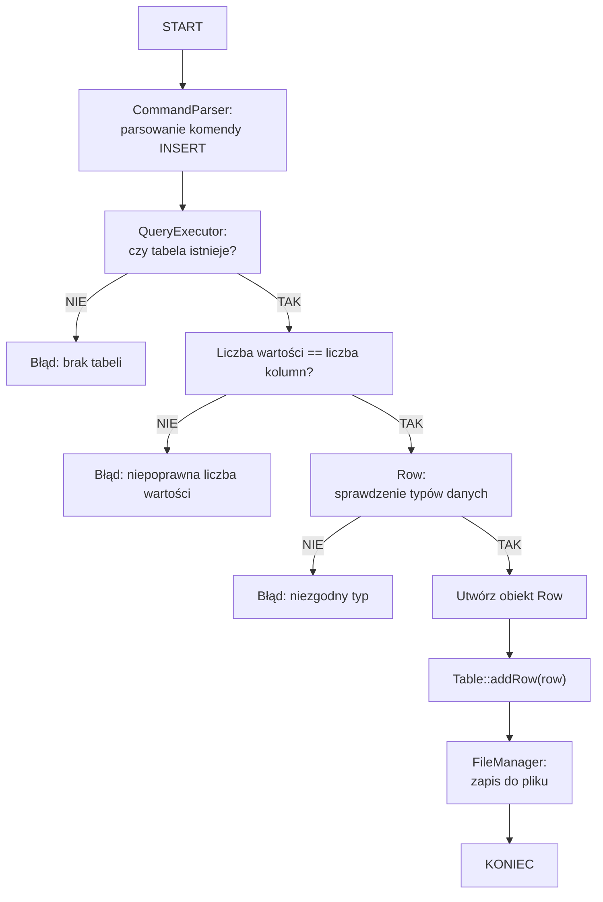
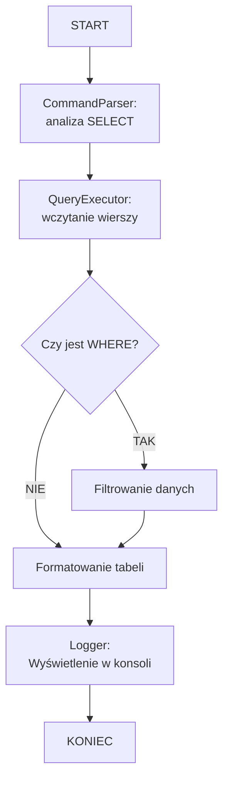
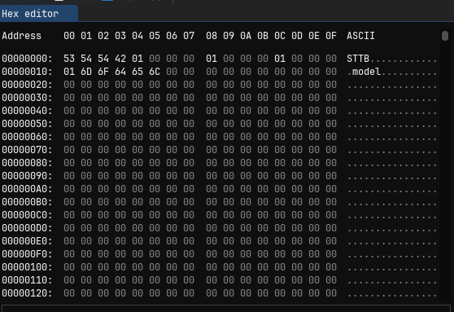
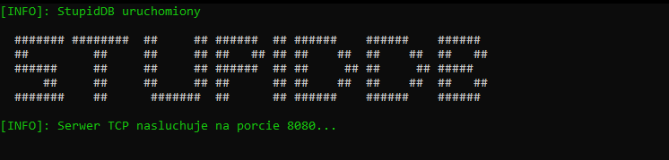
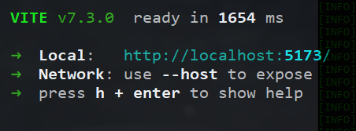
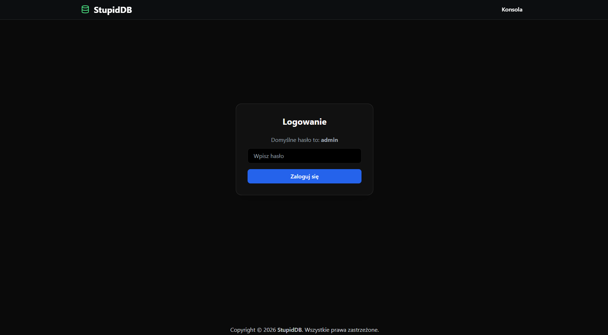
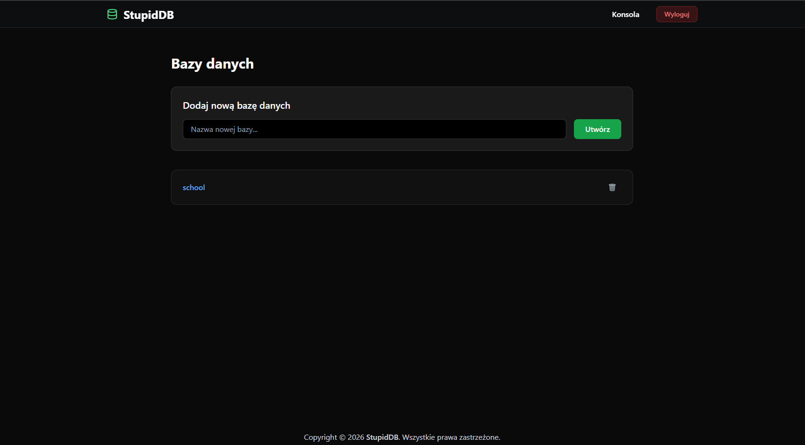
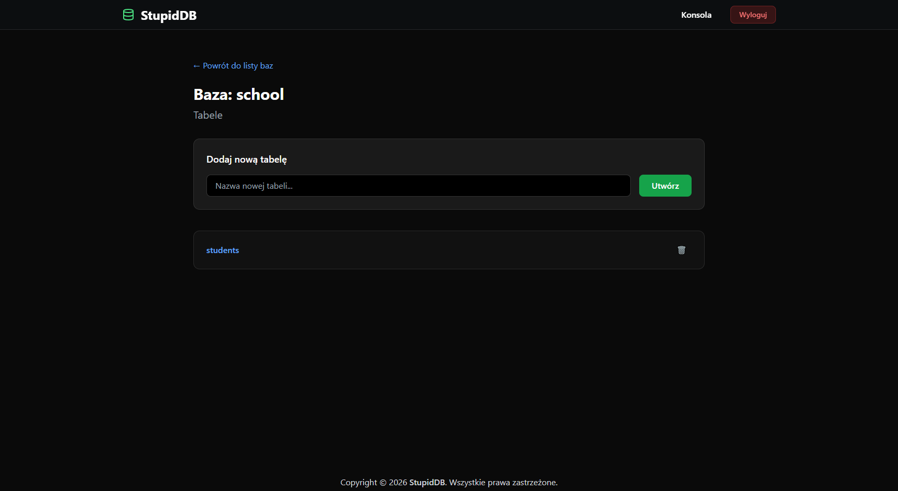
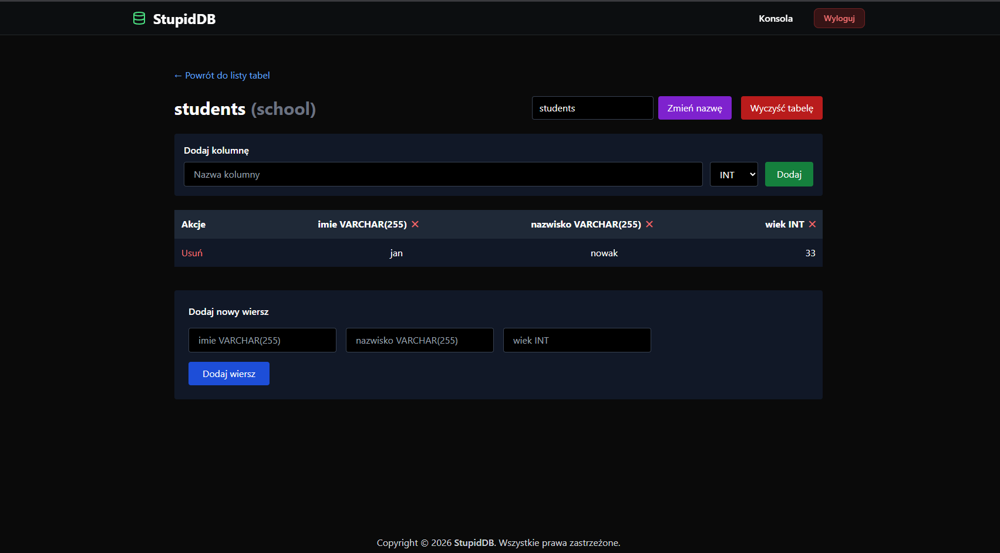

# StupidDB – Prosta baza danych w C++

**Autorzy:** 39066, 39483
**Data:** Luty 2026
**Wersja:** 1.0


## Spis treści

1.  [Opis problemu – cel projektu](#1-opis-problemu--cel-projektu)
2.  [Analiza problemu i teoretyczna propozycja rozwiązania](#2-analiza-problemu-i-teoretyczna-propozycja-rozwiązania)
3.  [Implementacja](#3-implementacja)
4.  [Testowanie](#4-testowanie)
5.  [Instrukcja obsługi](#5-instrukcja-obsługi)
6.  [Instrukcja kompilacji](#6-instrukcja-kompilacji)
7.  [Proponowane możliwości rozbudowy](#7-proponowane-możliwości-rozbudowy)
8.  [Screenshoty](#8-screenshoty)


---


## 1. Opis problemu – cel projektu


Naszym celem było stworzenie prostej bazy danych od zera w C++. Chcieliśmy pokazać jak działa system zarządzania bazą danych bez używania gotowych rozwiązań typu MySQL czy PostgreSQL.


Baza pozwala na:

- tworzenie i usuwanie baz danych
- dodawanie tabel i kolumn
- podstawowe operacje na danych (dodawanie, usuwanie, wyświetlanie)
- zapisywanie wszystkiego do plików na dysku

Projekt jest oczywiście bardzo uproszczony w porównaniu do prawdziwych baz danych, ale pokazuje podstawowe mechanizmy działania takich systemów.

  
## 2. Analiza problemu i koncepcja rozwiązania

### 2.1. Co chcieliśmy osiągnąć

Główne założenia:

-  **brak zewnętrznych bibliotek** – wszystko piszemy sami
-  **pliki binarne** – dane zapisujemy w formacie `.sttb`
-  **interfejs konsolowy** – proste polecenia tekstowe
-  **modułowa budowa** – żeby łatwo było dodawać nowe funkcje
-  **SRP i KISS**


Dodatkowo stworzyliśmy graficzny interfejs użytkownika (GUI) w React, co znacznie ułatwia zarządzanie i korzystanie z aplikacji.

  

### 2.2. Podział na moduły

Podzieliliśmy projekt na kilka głównych części:

| Moduł | Co robi |
|-------|---------|
|  `Database`  | Zarządzanie bazą danych i listą tabel |
|  `Table`  | Reprezentacja pojedynczej tabeli |
|  `Row`  | Reprezentacja pojedynczego wiersza |
|  `Column`  | Definicja kolumny (nazwa, typ) |
|  `CommandParser`  | Czyta i waliduje komendy użytkownika |
|  `QueryExecutor`  | Wykonuje zapytania na strukturach danych |
|  `FileManager`  | Obsługa zapisu i odczytu danych z plików |
|  `Serializer`  | Zamienia obiekty na bajty i z powrotem |
|  `Logger`  | Loguje co się dzieje w programie |

Podział ten realizuje zasadę **Single Responsibility Principle**, co ułatwia rozwój oraz testowanie systemu.
  

### 2.3. Diagram klas

Tak wygląda struktura naszych klas:

```
Database
│
├── Table 1
│    ├── Column (name, STRING)
│    ├── Column (age, INT)
│    └── Rows []
└── Table 2
└── ...
```

### 2.4. Jak działają najważniejsze algorytmy

#### INSERT - dodawanie danych

Algorytm INSERT działa w sposób sekwencyjny. Najpierw następuje walidacja zapytania oraz sprawdzenie istnienia tabeli. Następnie weryfikowana jest zgodność liczby i typów wartości z definicją kolumn. W przypadku błędów zgłaszane są wyjątki, co zapobiega uszkodzeniu danych. Po poprawnej walidacji dane są zapisywane w pamięci oraz synchronizowane z plikiem na dysku.



#### SELECT - wyświetlanie danych

Algorytm `SELECT` służy do pobierania i wyświetlania danych z tabeli.  
Najpierw **`CommandParser`** analizuje zapytanie i wyodrębnia nazwę tabeli oraz ewentualny warunek `WHERE`.



### 2.5. Struktura plików

Każda baza to folder z plikami:

```
db/ 								# głowny folder z bazami danych
└── przykladowa_baza/
		└──database.stdb 			# tabele w bazie (z kolumnami i wierszami)
```

****

  
Na początku pliku znajduje się nagłówek "STTB", co pozwala rozpoznać, że plik należy do bazy.


## 3. Implementacja

### 3.1. Struktura projektu

```
StupidDB/
├── back-end/
│   ├── build/                	# skompilowany program
│   ├── db/                  	# zapisane bazy danych
│   ├── dll_files/             	# biblioteka
│   ├── doc/                   	# dokumentacja modułów
│   ├── libs/
│   │   └── json.hpp          	# obsługa formatu JSON
│   ├── include                 # pliki nagłówkowe (.hpp)
│   ├── src/                   	# pliki źródłowe (.cpp)
│   │   ├── database/
│   │   │   ├── Column.cpp
│   │   │   ├── Row.cpp
│   │   │   └── Table.cpp
│   │   ├── parser/
│   │   │   ├── CommandParser.cpp
│   │   │   └── QueryExecutor.cpp
│   │   ├── server/
│   │   │   ├── HTTP_Server.cpp
│   │   │   ├── Session.cpp
│   │   │   └── TCP_Server.cpp
│   │   ├── storage/
│   │   │   └── FileManager.cpp
│   │   ├── utils/
│   │   │   └── Logger.cpp
│   │   └── main.cpp
│   ├── test/                  # testy
│   ├── install_mingw_sodium.sh 
│   ├── remove_mingw_sodium.sh
│   ├── Makefile
│   ├── password.txt
│   └── README
├── front-end/                 # GUI w React
├── front-end-cli/             # wersja konsolowa klienta
├── .gitignore
└── Makefile
```

### 3.2. Użyte techniki

Wykorzystaliśmy wszystkie wymagane elementy:

**Dziedziczenie:**
Klasa `HTTP_Server` dziedziczy po klasie `TCP_Server`, ponieważ serwer HTTP jest w praktyce serwerem TCP, tylko z dodatkową logiką.

``` c++
class  HTTP_Server  :  public  TCP_Server  {
private:
	...
public:
    HTTP_Server(int port)
        : TCP_Server(port, [this](socket_t client_fd) {
            this->handleHTTPRequest(client_fd);
        }) {}
};
```
Dzięki temu:
-   nie musimy drugi raz pisać obsługi gniazd sieciowych,
-   klasa `HTTP_Server` korzysta z gotowej logiki TCP,
-   dodajemy tylko obsługę zapytań HTTP.
---

**Hermetyzacja (ukrywanie danych)** 
Hermetyzacja polega na tym, że pola klasy są prywatne, a dostęp do nich odbywa się przez metody.

```c
class Table {
private:
    std::vector<Row> rows;
    std::vector<Column> columns;
	...
public:
    uint32_t getRowsCount() const;
    const std::vector<Column>& getColumns() const;
    ...
};
```
Dzięki temu:
-   nie da się przypadkowo zmienić danych tabeli z zewnątrz,
-   wszystkie operacje na danych są kontrolowane,
-   kod jest bezpieczniejszy i czytelniejszy.
---

**Obsługa błędów (walidacja i komunikaty):** 
Zamiast pozwalać programowi się wywalić, sprawdzamy poprawność danych i informujemy użytkownika o błędach.

```c
if (!tableExists(cmd.tableName)) {
    return QueryResponse::genError(
        HTTP_Status::NotFound,
        "Tabela nie istnieje"
    );
}
```
Dzięki temu:
-   program nie kończy się błędem
-   użytkownik dostaje czytelny komunikat,
-   łatwiej debugować aplikację.

---
** Modularna budowa (SRP)** 

Projekt został podzielony na moduły, z których każdy odpowiada za jedno zadanie:
-   `CommandParser` – rozbija tekst komendy na części,
-   `QueryExecutor` – wykonuje operacje na bazie danych,
-   `Table`, `Row`, `Column` – przechowują dane,
-   `FileManager` – zapis i odczyt z plików,
-   `Logger` – wyświetla komunikaty i błędy.
    
Takie podejście sprawia, że kod jest prostszy do rozwijania i testowania.


### 3.3. Komentarze

W projekcie zastosowaliśmy komentarze w kodzie, których celem jest ułatwienie zrozumienia działania programu oraz funkcji.

**Komentarze w plikach nagłówkowych**
W plikach nagłówkowych komentarze opisują **przeznaczenie klasy**, jej pola oraz dostępne metody.
```c
class Row {
private:
    int32_t rowID;        // ID wiersza
    RowValues cells;      // Wartości komórek
    ...
public:
	// Tworzy wiersz z wartościami
	Row(int32_t  rowID,  const  RowValues&  cells);
	// Dodaje wartość na końcu wiersza
	void  addCell(const  CellValue&  value);
	...
```

Dzięki temu od razu wiadomo:
-   co przechowuje klasa,
-   jaką rolę pełni dany element.

---
**Komentarze do metod**
Każda ważniejsza metoda posiada komentarz opisujący jej działanie.
```c
// Dodaje nową komórkę (wartość) do wiersza
void Row::addCell(const CellValue& value) {
    cells.push_back(value);
}
```
Komentarz jasno informuje:
-   co robi funkcja,
-   jaki jest jej efekt.

---
**Komentarze przy walidacji i obsłudze błędów**
W miejscach odpowiedzialnych za sprawdzanie poprawności danych zastosowano komentarze opisujące logikę działania.

```c
// Sprawdza czy wiersz jest zgodny z kolumnami tabeli
bool Row::validateAgainstColumns(const std::vector<Column>& columns) const {
    // Liczba komórek musi się zgadzać z liczbą kolumn
    if (cells.size() != columns.size()) {
        Logger::warn("Row: Liczba wartosci nie zgadza sie z liczba kolumn");
        return false;
    }
```
Komentarze pomagają zrozumieć:
-   jak jest wykonane sprawdzenie,
-   jaki bład zwraca błąd,
-   ułatwia zrozumienie logiki działania funkcji.
---
**Podział kodu na sekcje**
Kod został dodatkowo uporządkowany za pomocą komentarzy sekcyjnych, np.:

```c
// === OPERACJE NA KOMÓRKACH ===
// === WALIDACJA ===
// === KONWERSJE ===
```
Dzięki temu:
-   łatwiej odnaleźć potrzebne fragmenty kodu.


## 4. Testowanie

### 4.1. Testy kodu
Testowanie wykonaliśmy w formie **prostych testów funkcjonalnych** uruchamianych z poziomu programu. Każdy test sprawdza poprawność działania wybranego modułu i wypisuje wynik w konsoli (`[OK]` / `[FAIL]`).

Testy zostały napisane ręcznie (bez frameworków testowych), co było wystarczające dla skali projektu.

**Test modułu Logger**

Sprawdzane było czy dobrze w konsoli wyświetla odpowiednie komunikaty.
```c
void testLogger() {
	...
	// === 3. Logger ===
    Logger::info("To jest test INFO");
    Logger::warn("To jest test WARNING");
    Logger::error("To jest test ERROR");
}
```
  ---
**Test modułu FileManager**
Moduł `FileManager` został przetestowany najbardziej szczegółowo, ponieważ odpowiada za operacje na plikach i katalogach.

Zakres testów obejmował:
1.  **Tworzenie katalogów** (również z podkatalogami)
2.  **Sprawdzanie istnienia plików i katalogów**
3.  **Zapis i odczyt plików tekstowych**
4.  **Listowanie plików i katalogów**
5.  **Zapis i odczyt danych binarnych**
6.  **Sprawdzanie rozmiaru pliku**
7.  **Usuwanie plików**
8.  **Usuwanie katalogów**
9.  **Obsługę błędów** (np. plik nie istnieje)
 
 Fragment:
 ```c
void  testFileManager()  {
std::cout <<  "\n=== TESTUJEMY FileManager ===\n";

const std::string base =  "./test";
const std::string dir = base +  "/test_db";
const std::string sub = dir +  "/subdir";
const std::string file = dir +  "/data.txt";
const std::string bin = dir +  "/data.bin";

// === 1. createDirectory (z podkatalogami) ===
std::cout <<  "1. createDirectory\n";
if  (FileManager::createDirectory(sub))  {
std::cout <<  " [OK] Katalog utworzony: "  << sub <<  "\n";
}  else  {
std::cout <<  " [FAIL] Nie utworzono katalogu!\n";
return;
}

// === 2. exists + isDirectory ===
std::cout <<  "2. exists + isDirectory\n";
if  (FileManager::exists(dir)  && FileManager::isDirectory(dir))  {
std::cout <<  " [OK] exists() i isDirectory() dzialaja\n";
}  else  {
std::cout <<  " [FAIL] Blad sprawdzania istnienia!\n";
}
...
```

### 4.2. Wydajność

Do logów dopisalismy obliczanie czasu pomiędzy wykonywanymi połaczenia i widać poniżej bardzo szybką odpowiedź serwera w mikro sekkundach. 

```
		[INFO]: Polaczono z klientem: 127.0.0.1:45048 
		[INFO]: Otrzymano zadanie: POST /query 
		[INFO]: Otrzymano zapytanie: SELECTALL test1 
		[INFO]: Czas wykonania SELECT ALL: 11 us 
		[INFO]: Rozlaczono z klientem: 127.0.0.1:45048 
		[INFO]: Polaczono z klientem: 127.0.0.1:55230 
		[INFO]: Otrzymano zadanie: POST /query 
		[INFO]: Otrzymano zapytanie: INSERTINTO test1 VALUES ('test') 
		[INFO]: Czas wykonania INSERT: 22 us 
		[INFO]: Rozlaczono z klientem: 127.0.0.1:55230 
		[INFO]: Polaczono z klientem: 127.0.0.1:55246 
		[INFO]: Otrzymano zadanie: POST /query 
		[INFO]: Otrzymano zapytanie: USE "test" 
		[INFO]: Rozlaczono z klientem: 127.0.0.1:55246 
		[INFO]: Polaczono z klientem: 127.0.0.1:55248 
		[INFO]: Otrzymano zadanie: POST /query 
		[INFO]: Otrzymano zapytanie: DESCRIBE test1 
		[INFO]: Rozlaczono z klientem: 127.0.0.1:55248 
		[INFO]: Polaczono z klientem: 127.0.0.1:55258 
		[INFO]: Otrzymano zadanie: POST /query 
		[INFO]: Otrzymano zapytanie: SELECTALL test1 
		[INFO]: Czas wykonania SELECT ALL: 17 us 
		[INFO]: Rozlaczono z klientem: 127.0.0.1:55258
```

## 5. Instrukcja obsługi

Program obsługiwany jest z poziomu konsoli za pomocą prostych komend tekstowych. Poniżej przedstawiono podstawowe polecenia dostępne w systemie.

### 5.1.Podstawowe komendy do abzy danych


#### 1. Zarządzanie bazami danych (Database Management)
Komenda  Opis
`SHOWDATABASES` 	-Wyświetla wszystkie dostępne bazy danych w folderze `db/`.
`USE [nazwa]` 			-Przełącza się na wybraną bazę danych (jeśli nie istnieje – zostaje utworzona).
`USENONE` 				-Przestaje używać aktualnej bazy danych.
`DROPDATABASE [nazwa]` - Usuwa wybraną bazę danych wraz z jej plikami.

🗂 2. Operacje na tabelach (DDL – Data Definition Language)

`SHOWTABLES`  - Wyświetla listę tabel w bieżącej bazie danych.
`CREATETABLE [nazwa]`  - Tworzy nową tabelę.
`DROPTABLE [nazwa]` - Usuwa istniejącą tabelę.
`DESCRIBE [tabela]` / `DESC [tabela]` - Wyświetla strukturę tabeli (kolumny i ich typy).
`MODIFYTABLE [stara] [nowa]` -Zmienia nazwę tabeli.
`ADDCOLUMN [tabela] [kolumna] [typ]` -Dodaje nową kolumnę do tabeli.
`MODIFYCOLUMN [tabela] [stara] [nowa]` - Zmienia nazwę istniejącej kolumny.
`DROPCOLUMN [tabela] [kolumna]` - Usuwa kolumnę z tabeli.

💾 3. Operacje na danych (DML – Data Manipulation Language)

`INSERTINTO [tabela] VALUES (...)` - Wstawia nowy wiersz do tabeli.
`SELECTALL [tabela]` - Wyświetla wszystkie dane z tabeli.
`SELECT [tabela] WHERE [kolumna]=[wartosc]` - Wyświetla dane spełniające warunek.
`UPDATE [tabela] SET [kolumna]=[wartosc] WHERE ...`  - Aktualizuje dane w tabeli.
`DELETE [tabela] WHERE [kolumna]=[wartosc]` - Usuwa wybrane wiersze z tabeli.
`CLEARTABLE [tabela]` -Usuwa wszystkie dane z tabeli (czyści tabelę).
  
⚙️ 5. Komendy pomocnicze / systemowe

`HELP` - Wyświetla listę dostępnych komend.\
`EXIT` / `QUIT` - Zamyka program (działa tylko w trybie terminalowym).

## 6. Instrukcja kompilacji
W tej sekcji opisano, jak przygotować środowisko oraz skompilować i uruchomić projekt **StupidDB** na systemach Linux i Windows.

### 6.1. Co potrzebne
- kompilator **C++ (standard C++17)**
- narzędzie **Make**
- **Node.js** (wymagany do uruchomienia front-endu)

 ---

## Linux
### Uruchom ternminal i wpisz komendę/y w zależności od dystrybucji


#### Ubuntu, Linux Mint, PopOS! i inne dystrybucje Ubuntu-based

```sh
sudo apt-get  update
sudo apt-get  install  -y  build-essential  libsodium-dev  libcurl4-gnutls-dev  curl  git
curl -o-  https://raw.githubusercontent.com/nvm-sh/nvm/v0.40.3/install.sh  | bash
source .bashrc
nvm install  22
```


#### Fedora, CentOS, RedHat i inne dystrybucje Fedora-based lub RedHat-based

```sh
sudo dnf  install  -y  gcc-c++  make  git-core  nodejs  libsodium-devel  libcurl-devel  -y
```
#### OpenSuse

```sh
sudo zypper  install  -y  gcc-c++  make  git-core  nodejs  libsodium-devel  libcurl-devel  -y
```


#### Arch Linux, Manjaro, CachyOS, ArchCraft i inne dystrybucje Arch-based

```sh
sudo pacman  -S  gcc  make  git  nodejs  npm  libsodium  curl  -y
```

## Windows

1. Pobierz i zainstaluj MSYS2 z tego linku: https://www.msys2.org
2. Uruchom go i wpisz następującą komendę

```sh
pacman -S  mingw-w64-ucrt-x86_64-gcc  mingw-w64-ucrt-x86_64-curl  mingw-w64-ucrt-x86_64-libsodium  make  git  -y
```

3. Pobierz i zainstaluj node.js z tego linku: https://nodejs.org/en/download

---
## Pobieranie projektu

Uruchom terminal(dla Linuxa), MSYS2(dla Windowsa) i wpisz komende

```sh
git clone  https://github.com/PanDamax2/StupidDB.git
```

## Kompilacja(tylko dla back-endu i front-endu cli)

Uruchom terminal(dla Linuxa), MSYS2(dla Windowsa) i wpisz komendy

```sh
cd StupidDB
make
```

lub aby było szybciej

```sh
cd StupidDB
make -j[liczba wątków procesora bez spacji np. "make -j12" dla 12 wątków]
```

## Uruchamianie

## back-end i front-end cli

Uruchom terminal(dla Linuxa), MSYS2(dla Windowsa) i wpisz komendy.\

Dla back-endu
```sh
cd StupidDB
make run_back-end-cli
```

Dla front-endu cli(uruchom go w nowym oknie):

```sh
cd StupidDB
make run_front-end-cli
```

## front-end

### Linux

Uruchom terminal i wpisz komendy

```
cd StupidDB/front-end
npm i && npm run dev
```

### Windows

Otwórz folder z projektem, następnie otwórz folder back-end. Następnie kliknij na górny pasek w folderze gdzie jest ścieżka do pliku. Wpisz tam powershell, a następnie naciśnij enter. Jak się okno pojawi to wpisz w nie komendy

```
npm i
npm run dev
```

## 7. Możliwości rozbudowy

Mamy sporo pomysłów jak można by to rozwinąć:

- **Więcej operatorów WHERE** – AND, OR, NOT, >, <, >=, <=
- **JOIN** – łączenie danych z kilku tabel
- **ORDER BY** – sortowanie wyników
- **Funkcje agregujące** – COUNT, SUM, AVG, MAX, MIN

### Większe rozszerzenia:
- **GUI** – może w Qt albo wxWidgets
- **REST API** 
- **Backup automatyczny** – żeby nie stracić danych

### Optymalizacje:
- **Cache w pamięci** – żeby nie czytać z dysku za każdym razem
  


## 8. Screenshoty

Aplikacja posiada prosty i czytelny interfejs użytkownika, który ułatwia zarządzanie bazą danych.  

****
Uruchomienie API servera

****
Uruchomienie GUI

Wygląd frontend GUI
****
****
****
****